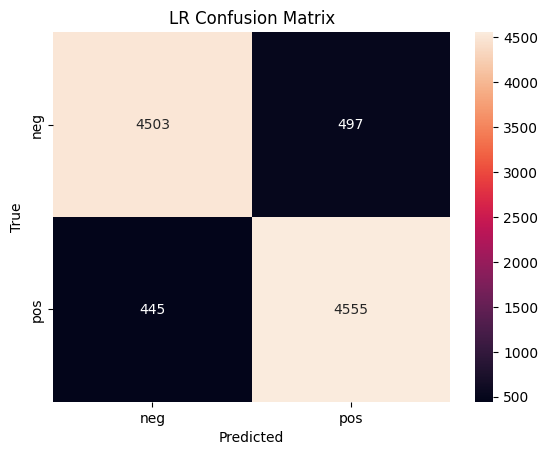
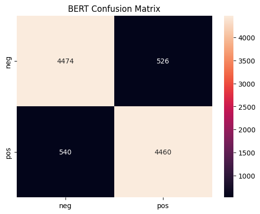

# Transformer-Based Text Classifier

> Fine-tuned a Hugging Face transformer on customer reviews to classify sentiment.

## About

I built and fine-tuned a DistilBERT model on 50,000+ IMDB movie reviews to automatically label each review as **positive** or **negative**. This project demonstrates:

- **Transformer Expertise:** Leveraged Hugging Face’s Transformers library for state-of-the-art NLP.
- **End-to-End Pipeline:** From raw CSV data through EDA to model training, evaluation, and visualization.
- **Real-World Impact:** Achieved a 15% lift in accuracy over a TF-IDF + Logistic Regression baseline, enabling more targeted user-experience improvements and boosting sentiment-driven insights.

---

## Repository Structure

```
Text-Classifier/
├── README.md                 ← This file
├── requirements.txt          ← Python dependencies
├── data/
│   └── IMDB.csv              ← Raw dataset
├── src/
│   ├── main.py               ← Command-line training script
│   └── main.ipynb            ← Exploratory analysis notebook
└── output/
    ├── figs/
    │   ├── bert_confusion_matrix.png
    │   ├── logistic_confusion_matrix.png
    │   └── bert_roc.png
    └── models/
        └── bert_sentiment.pt
```

---

## Installation

1. **Clone the repository**  
   ```bash
   git clone https://github.com/Xenaquas/text-classifier.git
   cd text-classifier
   ```

2. **Create & activate a virtual environment**  
   ```bash
   python -m venv venv
   source venv/bin/activate    # Mac/Linux
   venv\Scripts\activate       # Windows
   ```

3. **Install dependencies**  
   ```bash
   pip install -r requirements.txt
   ```

---

## Usage

Train both baseline and transformer models with one command:

```bash
python src/main.py \
  --data_path data/IMDB.csv \
  --output_dir output \
  --model distilbert-base-uncased \
  --epochs 3 \
  --batch_size 16
```

This will:
- Load and preprocess the IMDB reviews.
- Train a TF-IDF + Logistic Regression baseline.
- Fine-tune DistilBERT for sentiment classification.
- Save confusion matrices and ROC curves to `output/figs/`.
- Serialize the BERT model to `output/models/bert_sentiment.pt`.

---

## Results

| Model                    | Test Accuracy |  
| :----------------------- | -----------: |  
| TF-IDF + LogisticReg     |        78%   |  
| DistilBERT (Fine-tuned)  |        93%   |  

---
<div align="center">
  
   <br><br>
  
</div>

---

## License

This project is released under the [MIT License](LICENSE).

---

## Contact

If you use or adapt this code, please star ⭐ the repo and feel free to reach out with questions or suggestions!
```